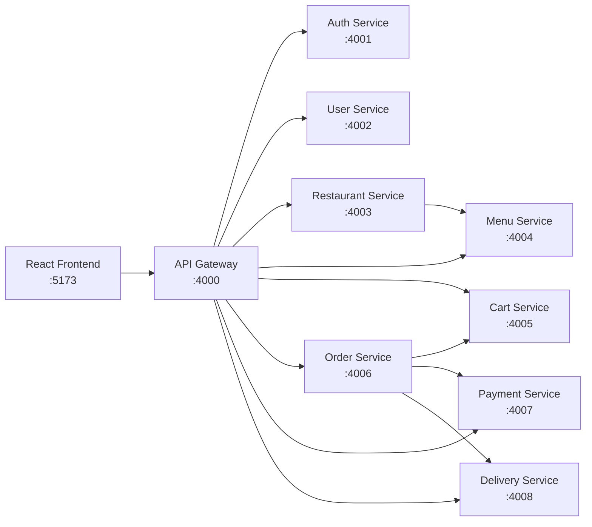

# Gourmet Flow / GrabMyFood

A premium food delivery platform built as a monorepo microservices architecture. The system comprises nine backend services behind an API gateway, a React frontend, and shared packages for cross-service concerns.

---

## Architecture



The **API Gateway** acts as the single entry point. All client requests hit the gateway, which proxies them to the appropriate downstream service. Services communicate synchronously over HTTP. The `order-service` orchestrates cross-service workflows involving cart, payment, and delivery.

---

## Service Responsibilities

| Service | Port | Responsibility |
|---------|------|----------------|
| Frontend | 5173 | React single-page application built with Vite |
| API Gateway | 4000 | Single entry point, request routing, rate limiting, auth header propagation |
| Auth Service | 4001 | User registration, login, JWT access & refresh tokens |
| User Service | 4002 | Profile management, delivery addresses, preferences |
| Restaurant Service | 4003 | Restaurant data, search, ratings & reviews |
| Menu Service | 4004 | Menu items, categories, modifiers, availability |
| Cart Service | 4005 | Shopping cart CRUD, promo code validation |
| Order Service | 4006 | Order lifecycle, status transitions, orchestration |
| Payment Service | 4007 | Mock payment processing, transaction records |
| Delivery Service | 4008 | Driver assignment, real-time tracking, delivery status |

---

## Folder Structure

```
gourmet-flow/
├── apps/
│   ├── api-gateway/          # Express-based reverse proxy
│   ├── auth-service/         # Authentication & JWT
│   ├── user-service/         # User profiles
│   ├── restaurant-service/   # Restaurant catalog
│   ├── menu-service/         # Menu & items
│   ├── cart-service/         # Shopping cart
│   ├── order-service/        # Order management
│   ├── payment-service/      # Payment processing
│   ├── delivery-service/     # Delivery tracking
│   └── frontend/             # React SPA (Vite)
├── packages/
│   ├── shared-config/        # Shared configuration utilities
│   ├── shared-errors/        # Common error classes & handling
│   ├── shared-logger/        # Pino-based structured logging
│   ├── shared-types/         # Shared JSDoc / TypeScript type definitions
│   └── shared-validation/    # Zod schemas reused across services
├── scripts/
│   └── init-dbs.sh           # PostgreSQL database initialization
├── docker-compose.yml        # Local development orchestration
├── .env.example              # Environment variable template
├── package.json              # Monorepo root (npm workspaces)
└── README.md
```

---

## Required Software

- **Node.js** 20+ (includes npm 10+)
- **PostgreSQL** 16 (optional for local dev without Docker)
- **Docker** & **Docker Compose** (optional, for containerized development)
- **Git** (for version control)

---

## Environment Configuration

Copy the example environment file and adjust as needed:

```bash
cp .env.example .env
```

Each service reads from the root `.env` file via `dotenv`. The `.env.example` documents every variable:

| Variable | Description |
|----------|-------------|
| `NODE_ENV` | Runtime environment (`development`, `production`) |
| `API_GATEWAY_PORT` | Gateway listen port (default: 4000) |
| `AUTH_SERVICE_PORT` | Auth service listen port (default: 4001) |
| `USER_SERVICE_PORT` | User service listen port (default: 4002) |
| `RESTAURANT_SERVICE_PORT` | Restaurant service listen port (default: 4003) |
| `MENU_SERVICE_PORT` | Menu service listen port (default: 4004) |
| `CART_SERVICE_PORT` | Cart service listen port (default: 4005) |
| `ORDER_SERVICE_PORT` | Order service listen port (default: 4006) |
| `PAYMENT_SERVICE_PORT` | Payment service listen port (default: 4007) |
| `DELIVERY_SERVICE_PORT` | Delivery service listen port (default: 4008) |
| `JWT_SECRET` | Secret key for signing JWT access tokens |
| `JWT_REFRESH_SECRET` | Secret key for signing JWT refresh tokens |
| `JWT_ACCESS_EXPIRATION` | Access token TTL (e.g. `15m`) |
| `JWT_REFRESH_EXPIRATION` | Refresh token TTL (e.g. `7d`) |
| `*_DATABASE_URL` | PostgreSQL connection strings for each service |
| `VITE_API_GATEWAY_URL` | Frontend API base URL |

**Never commit `.env` to version control.** It is already listed in `.gitignore`.

---

## Local Installation

From the monorepo root:

```bash
npm install
```

This installs dependencies for all workspaces (`apps/*` and `packages/*`) with a single command, thanks to npm workspaces.

---

## Running All Applications

### Option A — Docker Compose (recommended)

```bash
docker-compose up -d
```

This starts PostgreSQL and all 10 services. The `init-dbs.sh` script runs automatically on first database startup, creating all eight databases.

### Option B — Local (without Docker)

Start each service in its own terminal:

```bash
# Terminal 1: Auth service
npm run dev:auth

# Terminal 2: User service
npm run dev:user

# Terminal 3: Restaurant service
npm run dev:restaurant

# Terminal 4: Menu service
npm run dev:menu

# Terminal 5: Cart service
npm run dev:cart

# Terminal 6: Order service
npm run dev:order

# Terminal 7: Payment service
npm run dev:payment

# Terminal 8: Delivery service
npm run dev:delivery

# Terminal 9: API Gateway
npm run dev:gateway

# Terminal 10: Frontend
npm run dev:frontend
```

> **Note:** When running locally, ensure PostgreSQL is running and all databases exist (see Database Setup below).

---

## Running One Service

To develop a single service in isolation:

```bash
npm run dev:auth
```

Or using the workspace syntax directly:

```bash
npm run dev --workspace=apps/auth-service
```

---

## Database Setup

### With Docker (automated)

When starting via `docker-compose up`, the `scripts/init-dbs.sh` script runs inside the PostgreSQL container and creates all databases. No manual steps required.

### Without Docker

Ensure PostgreSQL 16 is running locally, then create the databases:

```bash
createdb gourmet-auth
createdb gourmet-user
createdb gourmet-restaurant
createdb gourmet-menu
createdb gourmet-cart
createdb gourmet-order
createdb gourmet-payment
createdb gourmet-delivery
```

### Run Prisma Migrations

Each service manages its own database schema via Prisma. Apply migrations per service:

```bash
cd apps/auth-service && npx prisma migrate dev --name init
cd apps/user-service && npx prisma migrate dev --name init
cd apps/restaurant-service && npx prisma migrate dev --name init
cd apps/menu-service && npx prisma migrate dev --name init
cd apps/cart-service && npx prisma migrate dev --name init
cd apps/order-service && npx prisma migrate dev --name init
cd apps/payment-service && npx prisma migrate dev --name init
cd apps/delivery-service && npx prisma migrate dev --name init
```

---

## Seed Commands

Populate each service with sample data:

```bash
cd apps/auth-service && node prisma/seed.js
cd apps/user-service && node prisma/seed.js
cd apps/restaurant-service && node prisma/seed.js
cd apps/menu-service && node prisma/seed.js
cd apps/cart-service && node prisma/seed.js
cd apps/order-service && node prisma/seed.js
cd apps/payment-service && node prisma/seed.js
cd apps/delivery-service && node prisma/seed.js
```

---

## API Gateway Routes

The gateway runs on port `4000` and forwards requests to downstream services by path prefix.

| Route | Target Service | Description |
|-------|----------------|-------------|
| `/api/auth/*` | Auth Service | Signup, login, token refresh, logout |
| `/api/users/*` | User Service | Profile CRUD, address management |
| `/api/restaurants/*` | Restaurant Service | Listing, detail, search, reviews |
| `/api/menu/*` | Menu Service | Menu items by restaurant, categories |
| `/api/cart/*` | Cart Service | Cart CRUD, promo code application |
| `/api/orders/*` | Order Service | Create, list, status, history |
| `/api/payments/*` | Payment Service | Process payment, transaction lookup |
| `/api/delivery/*` | Delivery Service | Track delivery, driver info |
| `/api/devops-ai/*` | DevOps AI Agent | Optional proxy to the DevOps AI backend `/api/v1/*` |

---

## DevOps AI Agent Connection

This repo is configured to connect to your local DevOps AI agent at:

```bash
/Users/admin/Documents/Ai Agent/devops-ai-command-center
```

Start Gourmet Flow normally, then run the agent from the Gourmet Flow monorepo root:

```bash
npm run dev:agent
```

The script starts the DevOps AI backend on `http://localhost:5001` and its frontend on `http://localhost:5174` to avoid colliding with Gourmet Flow's frontend on `5173`. Gourmet Flow also exposes a gateway status check at:

```bash
curl http://localhost:4000/devops-ai/status
```

The frontend navigation includes a `DevOps AI` link controlled by `VITE_DEVOPS_AI_URL`.

---

## Kubernetes Secret

Production deployments reference a Kubernetes Secret named `gourmet-flow-secrets` in the `gourmet-flow` namespace. If pods show `CreateContainerConfigError` with `secret "gourmet-flow-secrets" not found`, create or update the Secret before restarting deployments:

```bash
export JWT_SECRET="..."
export JWT_REFRESH_SECRET="..."
export AUTH_DATABASE_URL="..."
export USER_DATABASE_URL="..."
export RESTAURANT_DATABASE_URL="..."
export MENU_DATABASE_URL="..."
export CART_DATABASE_URL="..."
export ORDER_DATABASE_URL="..."
export PAYMENT_DATABASE_URL="..."
export DELIVERY_DATABASE_URL="..."

npm run k8s:create-secret
kubectl rollout restart deployment/api-gateway -n gourmet-flow
```

Use the same pattern for any other stuck deployment, or restart all workloads in the namespace:

```bash
kubectl rollout restart deployment -n gourmet-flow
```

The Helm chart now sets `secrets.create=true`, so Argo CD creates and manages the `gourmet-flow-secrets` Secret automatically on every sync. The values live in `infra/helm/gourmet-flow/values.yaml` and mirror `infra/k8s/secrets.yaml`. The manual out-of-band flow above is only needed if you rotate the values.

---

## Prometheus Metrics

Every backend service exposes Prometheus metrics at `/metrics`, including default Node.js process metrics and `http_request_duration_seconds`.

After building and deploying new service images, verify one service from inside the cluster:

```bash
kubectl port-forward svc/api-gateway 4000:4000 -n gourmet-flow
curl http://localhost:4000/metrics
```

The plain Kubernetes Services include Prometheus scrape annotations. If your cluster uses the Prometheus Operator, apply the optional ServiceMonitor after confirming the CRD exists:

```bash
kubectl get crd servicemonitors.monitoring.coreos.com
kubectl apply -f infra/k8s/servicemonitor.yaml
```

For Helm deployments, enable the chart-managed ServiceMonitor:

```bash
helm upgrade --install grabmyfood infra/helm/gourmet-flow \
  --namespace gourmet-flow \
  --set metrics.serviceMonitor.enabled=true
```

The ServiceMonitor targets the backend services only; the frontend is intentionally skipped.

---

## Shared Packages

Cross-cutting concerns are extracted into `packages/` for reuse:

| Package | Description |
|---------|-------------|
| `shared-config` | Centralized configuration loading from environment variables |
| `shared-errors` | Standardized error classes (`AppError`, `NotFoundError`, `ValidationError`) with HTTP status mapping |
| `shared-logger` | Pino-based structured JSON logger with request context support |
| `shared-types` | Shared type definitions and JSDoc annotations |
| `shared-validation` | Zod schemas for common entities (pagination, IDs, dates) |

These packages are referenced as `@gourmet-flow/shared-*` in service `package.json` files.

---

## Testing

Run tests for all workspaces:

```bash
npm test
```

Run tests for a single service:

```bash
npm test --workspace=apps/auth-service
```

Tests use Jest with the `--experimental-vm-modules` flag for ESM support.

---

## Linting & Formatting

```bash
# Lint all files
npm run lint

# Format all files
npm run format

# Check formatting (CI use)
npm run format:check
```

Configuration lives in `eslint.config.js` (flat config) and `.prettierrc`.

---

## Docker Compose

### Start all services

```bash
docker-compose up -d
```

### View logs

```bash
docker-compose logs -f
```

### Follow a specific service

```bash
docker-compose logs -f auth-service
```

### Rebuild images after changes

```bash
docker-compose build
```

### Stop all services

```bash
docker-compose down
```

### Stop and remove volumes (reset data)

```bash
docker-compose down -v
```

---

## Troubleshooting

### PostgreSQL connection refused

Ensure PostgreSQL is running and the `DATABASE_URL` in `.env` points to the correct host:
- **Docker**: use `postgres` (container name)
- **Local**: use `localhost`

### Port already in use

Each service binds to a specific port. If a port is occupied, change it in `.env` and update the corresponding `ports` mapping in `docker-compose.yml`.

### Docker build fails

- Ensure you are running from the monorepo root when using `docker-compose up`
- Dockerfiles expect a `package.json` at the service root and run `npm install` inside the container
- If a service depends on shared packages, those must be copied into the container or published to a registry (see DevOps plan)

### Prisma migration errors

Ensure the target database exists before running `prisma migrate dev`. Use the `createdb` commands above or let the Docker init script create them.

---

## Future DevOps Deployment Plan

1. **Containerize each service** — Multi-stage Dockerfiles reduce final image size (completed)
2. **Deploy to Kubernetes** — Define Deployments, Services, and Ingress for each microservice
3. **Add CI/CD** — GitHub Actions or GitLab CI for automated testing, building, and deployment
4. **Add monitoring** — Prometheus metrics, structured logging aggregation (e.g. Loki), dashboards (Grafana)
5. **Scale horizontally** — Stateless services (API gateway, auth, menu, etc.) can be replicated; stateful services (PostgreSQL) use managed cloud databases
6. **Service mesh** — Add mutual TLS, traffic splitting, and observability with Linkerd or Istio
7. **API versioning** — Introduce `/api/v1/` prefix pattern for backward-compatible evolution
